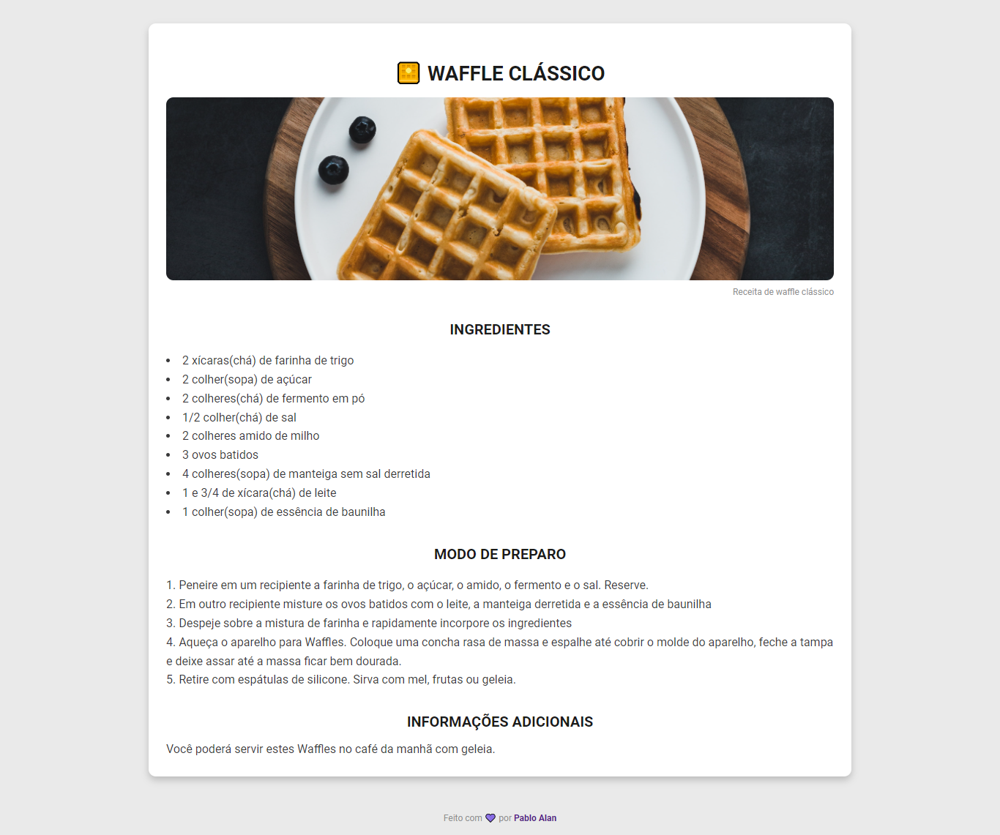

<h1 align="center">Página de Receita</h1>

 <a href="📷-Demonstration">Demonstration</a> |
 <a href="#💻-Deploy">Deploy</a> |
 <a href="#🚀-Technologies">Technologies</a> |
 <a href="#📋-Clipboard-(Pré-requisitos)">Clipboard</a> |
 <a href="#⚙-Settings">Settings</a>

---

Este é um projeto básico de uma Página de Receita, onde é apresentado como preparar a receita de Waffle Clássico 🧇.

* Para quem quiser realizar o desafio, acesse o link: <a target="_blank" href="https://efficient-sloth-d85.notion.site/Desafio-Piloto-P-gina-de-Receita-15acc6a34f744484a2e64a1f115bfbae">Link Desafio</a>

* OBS: estes desafios foram desenvolvidos pela empresa da <a target="_blank" href="https://www.rocketseat.com.br/">Rocketseat</a>

* Caso goste do projeto marque a estrelinha⭐ e compartilhe para me ajudar 👍, e me siga para ver outros projetos meus.

## 📷 Demonstration

    

## 💻 Deploy
- Clique no link a seguir para executar o projeot na sua máquina: <a target="_blank" href="https://pagina-de-receita-three.vercel.app/">Link</a>

## 🚀 Technologies
✔ [ReactJS](https://reactjs.org/)
 

✔ [TypeScript](https://www.typescriptlang.org/)
 

✔ [Styled Components](https://styled-components.com/)
 

## 📋 Clipboard (Pré-requisitos)
- Antes de baixar o projeto você vai precisar ter instalado na sua máquina as seguintes ferramentas:
    * [Git](https://git-scm.com)
    * [NodeJS](https://nodejs.org/en/)
    * [Yarn](https://yarnpkg.com/) ou [NPM](https://www.npmjs.com/)

## ⚙ Settings
- Segue os comandos para baixar e executar o projeto na sua máquina:
    * `git clone` + `URL do Projeto`: clonar este repositório.
    * `cd Pagina-de-Receita`: acessa a pasta do projeto no terminal.
    * `yarn`: para baixar as dependências do projeto.
    * `yarn start`: 
        - Executa o projeto em modo/ambiente de desenvolvimento.
        - Abra [http://localhost:3000](http://localhost:3000) para ver o projeto rodando no Navegador.
        - A página será recarregada se você fizer edições no código, e se tiver algum erro será mostrado no console.
    * `yarn build`: 
        - Compila a aplicação para a produção na pasta `build`.

## ✍ Author

    Made with 💜 by PabloXT14

    
    

